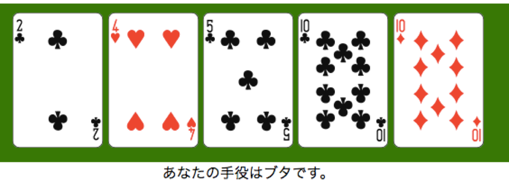
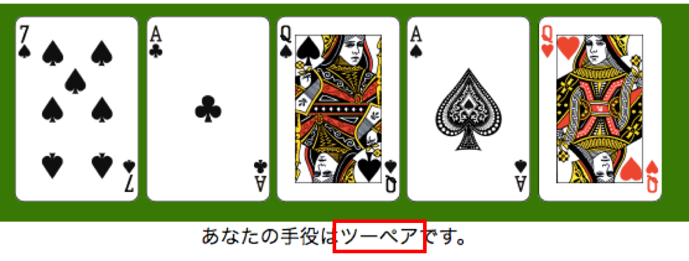

# ポーカー
## 仕様
<br/>
<br />
画面の目標は上図です。<br />
相手の役判定や勝敗判定は不要ですが、余裕がある方はチャレンジしてみてください。<br />
<br />
1. ジョーカーを抜いた52枚のカードを使用します。<br />
2. 52枚のカードからランダムに5枚のカードを手札とし、画面に表示させてください。<br />
3. 下図のように役判定もしてください。（役判定については後述します。）<br />

<br/>

## 素材
* トランプ画像 => `image_trump/` <br />
gif画像とpng画像があります。お好きな方を利用してください。

* 役判定クラス => `poker.php` <br />
後述します。

## 提出方法
**7月末日**までに各担当者に自分が作成したソースコードを提出してください。<br />
`poker.php`を改修した方は`poker.php`も送ってください。<br />
あがった質問などは随時[こちらのページ](https://github.com/naoki85/poker/wiki/Q&A)にまとめています。

## 評価方法
7/6 修正<br />
[Wiki](https://github.com/naoki85/poker/wiki)に記載しました。

## 研修生のみなさまへ
研修中の方には難解かもしれません。<br />
しかし、ぜひチャレンジしていただきたいと願っております。<br />
ただ、あまりに考えて分からない場合は担当者に質問してみてください。

## PHP以外の言語で取り組むみなさまへ
Java、JavaScript、Rubyなどの言語を現場で利用していて、その言語で取り組みたいという方は以下の方法のどちらかを選択してください。<br />
1. `poker.php`を書き換えて使用。<br />
2. 米山が作成した貧弱な`api.php`を使用する。`curl`で叩きにいく用です。<br />
（本当はAPI化したかったのですが、JSON形式で渡すにはblueサーバーのPHPバージョンが古すぎたようです。）<br />
`api.php`は個別で配布します。<br />
米山、もしくは担当者にご相談をお願いします。

## 役判定クラスについて
`poker.php`内の`getYaku`メソッドを呼ぶことで現在の手札の役を判定します。<br />
ただし、以下の条件があります。<br />
* カード1枚1枚に、連想配列で`number`（数字）と`mark`（マーク）をもたせてください。<br />

```php
// 例：スペードの10
"number" => 10, "mark" => spades

/*
マークは揃っていれば何でもいいですが、悩むのが面倒な方は、
スペード => spades
ハート	=> hearts
ダイヤ	=> diams
クラブ	=> clubs
としましょう。
*/
```

* 5枚の手札は連想配列で以下のようにし、これを`poker.php`内の`getYaku`メソッドに渡してください。<br />
（手札はそのときそのときで変わります。また、以下の連想配列はあくまで一例です。）

```php
// 手札
$myHand = array(
	array("number" => 12, "mark" => "clubs"),	// クラブのクイーン
	array("number" =>  7, "mark" => "hearts"),	// ハートの7
	array("number" =>  1, "mark" => "spades"),	// スペードのA
	array("number" =>  8, "mark" => "spades"),	// スペードの8
	array("number" =>  6, "mark" => "hearts"),	// ハートの6
	);
```